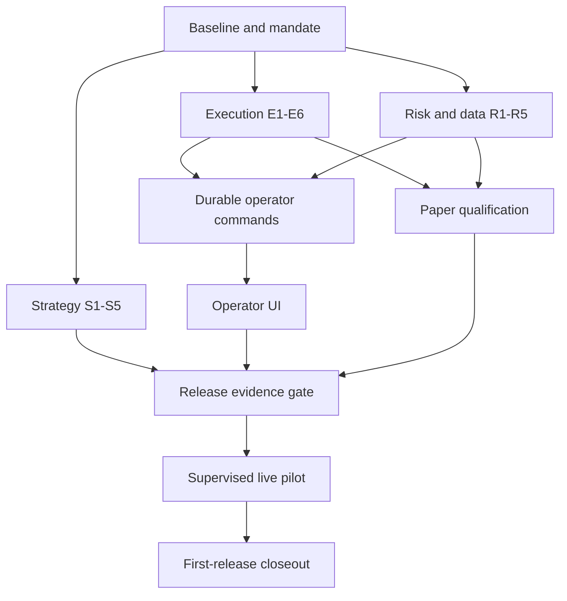

# Agenthedge Platform Completion Implementation Plan

> **For agentic workers:** Use superpowers:subagent-driven-development or superpowers:executing-plans to implement this plan task by task. Steps use checkboxes for tracking. This document is a proposed plan; no implementation or trading enablement has occurred.

**Goal:** Deliver a reliable owner-operated trading platform with correct accounting, effective risk controls, credible strategy evaluation, usable operations, and evidence-gated paper/live releases.

**Architecture:** Preserve the existing agent pipeline and BrokerAdapter. Add durable economic events and explicit runtime control, converge risk/data/replay contracts, and expose the durable worker through the operator interface. Qualify external libraries behind narrow adapters.

**Tech Stack:** Existing Python 3.12+, Poetry, PostgreSQL 16 CI baseline, pytest, Streamlit, APScheduler; proposed decimal ledger and selectively qualified alpaca-py/exchange_calendars/Hypothesis.

**Spec:** [Completion research and design](../specs/2026-09-14-platform-completion-research.md).

## Global constraints

- Planning baseline: `9426494ffa368f43f7d8c4cd6aee11588e5e0385`; re-read AGENTS.md, classify scope and inspect current HEAD before each implementation slice.
- First-release scope is proposed: one owner account, US equities/ETFs, USD, whole-share long positions, regular hours. This does not complete the multi-asset executive specification.
- Preserve `.env`, unrelated edits, existing storage and audit evidence. Fixture runs use isolated paths, simulated execution and disabled dotenv.
- Broker-backed qualification uses PostgreSQL and separate account/mode namespaces. Simulation continues to support isolated JSON state.
- No live-account identity, capital amount, credentials, production target or risk acceptance is invented. A release remains blocked when these required inputs are unavailable.
- No automatic live promotion, weakened approval chain, disabled coverage gate or retrospective fabricated evidence.
- Runtime/broker operations may be retried only with durable identity and verified semantics; exactly-once external order delivery is not promised.
- Existing broker and data contracts remain behind adapters; do not install a moving branch or copy upstream code without license/version review.
- Reviewer and tester are required for each nontrivial protected implementation. Use ui-hardener for O2 and test-isolation for demonstrated nondeterminism.
- Local plan IDs below are not GitHub/Linear issue keys. Create external issues only if subsequently requested.

## Work packages and dependency map

| Package | Tasks | Engineer-days | Deliverable |
| --- | --- | --- | --- |
| Baseline | B1 | 3-4 | Reproducible evidence and supported mandate |
| [Execution and accounting](2026-09-14-completion-execution.md) | E1-E6 | 12-17 | Durable, recoverable economic state and effective halt |
| [Risk and data](2026-09-14-completion-risk-data.md) | R1-R5 | 9-13 | Unified policy, fresh inputs and session-aware controls |
| [Strategy and replay](2026-09-14-completion-strategy.md) | S1-S5 | 10-14 | Causal evaluation and controlled learning |
| [Operations and release](2026-09-14-completion-operations.md) | O1-O5 | 10-15 | Usable operator workflows and observed qualification |
| Integration closeout | I1 | 1-2 | Exact-release completion decision |
| **Total** | **23 tasks** | **45-65** | First-release completion, subject to acceptance gates |



E3 owns the shared economic reducer. R1 owns the policy/portfolio valuation contract. S1 owns the clock/snapshot contract. O1 owns the command interface. Agents working in parallel consume those contracts after their review; they do not independently invent competing versions. Schedule E4 database work serially with R2/O1 schema work.

## Proposed contract catalogue

These are new interfaces to implement in their owning tasks, not assertions about existing APIs. Use decimal strings at serialization boundaries. Keep existing float-based public callers working through explicit conversion until the migration is accepted.

| Owner | New module and interface | Exact contract |
| --- | --- | --- |
| E3 | `portfolio/accounting.py` | `apply_trade(state: AccountingState, *, symbol: str, quantity: Decimal, price: Decimal, fee: Decimal = Decimal("0")) -> AccountingState`; `AccountingState(cash, realized_pnl, positions)`, `PositionState(quantity, average_cost)` are frozen dataclasses with Decimal numeric fields |
| E4 | `portfolio/journal.py` | `record_intent(account_id: str, mode: str, client_order_id: str, payload: dict[str, object]) -> str`; `apply_event(event: EconomicEvent) -> bool`; bool is true only for first durable application; EconomicEvent and payload variants are defined below |
| E5 | `portfolio/reconciliation.py` | `reconcile(account_id: str, mode: str) -> ReconciliationReport`; fields complete: bool, unresolved_orders: tuple[str, ...], mismatches: tuple[str, ...], as_of: datetime |
| E6 | `ops/control.py` | `halt(*, command_id: str, reason: str) -> ControlResult`; fields command_id: str, state: str, open_owned_orders: tuple[str, ...], unresolved: tuple[str, ...]; permitted state values defined in spec |
| R1 | `risk/policy.py` | `RiskPolicy.from_mapping(values: dict[str, object]) -> RiskPolicy`; immutable validated policy with content hash |
| R1 | `risk/valuation.py` | `projected_exposure(*, positions: dict[str, Decimal], reservations: tuple[WorkingOrderReservation, ...], symbol: str, delta: Decimal, marks: dict[str, Decimal], cash: Decimal) -> dict[str, Decimal]`; keys nav, symbol_notional, gross_notional; each reservation has order_id: str, symbol: str, side: str, remaining_quantity: Decimal, worst_price: Decimal, reserved_buying_power: Decimal, state: str. States submitted/accepted/partial/cancel_pending/unknown retain the remaining reservation; only confirmed terminal economics release it |
| R2 | `risk/session.py` | `SessionRiskState(session_id: str, opening_equity: Decimal, external_flows: Decimal, halted: bool)`; `session_return(state: SessionRiskState, equity: Decimal) -> Decimal` |
| R3/S1 | `data/snapshot.py` | CanonicalSnapshot has symbol: str, event_at/available_at/received_at: datetime, quote: CanonicalQuote, source/revision/checksum: str, fundamentals: dict[str, ResearchObservation], news: tuple[ResearchObservation, ...]; price property returns quote.last. CanonicalQuote has last/previous_close: Decimal, bid/ask/volume: Decimal or None. ResearchObservation has value: object, event_at/available_at: datetime, source/revision/checksum: str. All times UTC-aware; research visibility checked individually |
| S1 | `backtest/clock.py` | `ReplayClock(start: datetime)`, `now() -> datetime`, `advance(value: datetime) -> None`; reject backward time |
| S2 | `backtest/fills.py` | `next_fill(*, submitted_at: datetime, side: str, limit: Decimal, quantity: Decimal, event_at: datetime, bid: Decimal, ask: Decimal, available_volume: Decimal) -> tuple[Decimal, Decimal] | None`; returns fill quantity and price |
| O1 | `ops/commands.py` | `submit(*, command_id: str, account_id: str, mode: str, action: str, expected_release: str) -> str`; durable command identity; action allowlist and status readback described in O1 |

Missing or contradictory external economic data returns a blocked/recovery state; never synthesize a fill or mutate cash to make reconciliation appear green. Data and policy classes must reject non-finite decimal values explicitly.

**Economic event variants owned by E4:** `EconomicEvent(account_id: str, mode: str, event_id: str, occurred_at: datetime, source_hash: str, payload: TradePayload | CashPayload | SplitPayload | CorrectionPayload)`. The four frozen payload dataclasses are:

- `TradePayload(order_id: str, symbol: str, quantity: Decimal, price: Decimal, fee: Decimal, fee_reference: str | None = None)`; signed quantity, positive price, explicitly denominated USD fee. Nonzero fees require a stable source fee reference.
- `CashPayload(amount: Decimal, reason: str, symbol: str | None, fee_reference: str | None = None)`; signed USD delta, reason from dividend/transfer/fee/interest. A transfer is an external flow for R2; a dividend is investment income. Nonzero standalone fees require a stable source fee reference. The same reference and charge reported in a trade and a cash event has one economic effect; contradictory charges require recovery. No reference is inferred from matching amounts or symbols.
- `SplitPayload(symbol: str, ratio: Decimal)`; positive new-shares/old-shares ratio; scales quantity and inversely scales basis, preserving value before rounding rules.
- `CorrectionPayload(reverses_event_id: str, replacement: TradePayload | CashPayload | SplitPayload | None)`; references an existing immutable event; rebuild affected projections from the corrected event history. Do not model a trade bust as an ordinary sale or fabricate a new economic history. Unknown references produce RECOVERY_REQUIRED.

Only TradePayload goes to E3's apply_trade directly. E4 projects all variants transactionally and preserves original/replacement provenance. Tax basis and broker accounting conventions must be normalized explicitly before cost reconciliation.

## B1 — Baseline, mandate and regression acceptance

**Files:** Create `docs/release/mandate.md`, `docs/release/regression-matrix.md`; add tests under existing agent/portfolio/data suites; preserve the September audit as source evidence. Inspect `docs/execspec.md`, `docs/RISK_MANAGEMENT.md`, `docs/READINESS_CHECKLIST.md`, `docs/GOVERNANCE.md`.

**Steps**

- [ ] Record branch/SHA, classify the first slice, and create an isolated `codex/` worktree. Inventory existing tests and protect all current storage paths.
- [ ] Write the regression matrix below as named tests, starting with failing assertions derived from the saved probes. Run each once against the baseline and preserve the actual failure; do not weaken expectations to match the defect.
- [ ] Record the proposed mandate, policy conflicts (2% warning versus pause; 1/3/5 sessions), account namespace, permitted order types and data availability. Obtain owner decisions only for unresolved real-money settings before their activation, not before making the plan concrete.
- [ ] Verify baseline full-suite/coverage/type/lint/package outputs in the isolated tree. Label unavailable infrastructure as skipped/blocked. Reviewer checks the matrix against all audit findings.
- [ ] Commit only the baseline documentation and intentionally added regression tests on the slice branch. Do not merge a branch with intentionally failing tests; the corresponding repair PR must make them pass.

| Regression | Required result | Owner |
| --- | --- | --- |
| cumulative partial fills | 1@$100 then cumulative 2@$110 => $780 cash/$110 basis from $1000 | E3/E4 |
| crash before fill application | final order resumes accounting on restart | E4/E5 |
| duplicate execution | one economic effect across restart/concurrency | E4 |
| position reversal | +1@$100, sell 2@$120 => -1@$120 basis | E3 |
| rollback transcript | no mutation claim without controller readback | E1/O1 |
| malicious paper hostname | reject before credentials attached | E2 |
| gradual session loss | 100000,98000,96040,94119.2 => halt | R2 |
| repeated small orders | combined pending/filled exposure cannot exceed policy | R1 |
| stale/non-finite quote | new exposure blocked at decision and submission | R3 |
| missing risk history | unavailable estimate, increased risk blocked | R4 |
| stop-loss/cancel race | reduce-only control and late fill accounted | E6/R2 |
| runtime news/replay mismatch | same input snapshot gives same decision | S1 |
| same-bar fill/future data | no retrospective fill; future mutation leaves prior signals unchanged | S2/S4 |
| output-directory escape | replay writes nothing outside its run root | S1 |

## Verification protocol for every implementation task

Run the named narrow test first, then the affected package and broader checks when shared behavior changes. Use the repository's supported interpreter (`poetry run`); no environment file reads in unit/fault tests. Test new SQL against a dedicated local/container PostgreSQL database, never an existing trading database.

```powershell
$env:PYTHON_DOTENV_DISABLED='1'
$env:EXECUTION_MODE='simulated'
poetry run pytest --cov=src --cov-fail-under=80
poetry run mypy src
poetry run flake8 src tests
poetry build
poetry run python scripts/package_smoke.py
```

Do not run this broad suite until test paths and generated outputs are isolated. PostgreSQL integration jobs must pass on Linux and the supported Windows client environment. After push, inspect exact-head CI and required checks; retain current signing, dependency audit and coverage requirements. A passing test proves only its asserted behavior.

## I1 — Completion review

**Files:** Update `docs/READINESS_CHECKLIST.md`, `docs/ROADMAP.md`, `docs/OPS_RUNBOOK.md`; create `docs/release/first-release-closeout.md` with sanitized links to actual evidence.

- [ ] Check every E/R/S/O task and G0-G6 gate against the exact release SHA/configuration/strategy/data hashes. Missing evidence is a blocker, not a checked box.
- [ ] Have reviewer assess unresolved failures and tester assess coverage of real workflows; review the actual operator demo and paper/live closeout artifacts.
- [ ] Record outcome as first-release-complete, paper-only, or blocked with exact reason. Keep the original multi-asset scope explicitly incomplete until expansion acceptance occurs.
- [ ] Run documentation/link validation and exact-release checks affected by the final changes; archive evidence without credentials/account secrets.
- [ ] Commit the focused closeout; create/update its PR if authorized execution is underway. Merge only under live repository rules. Do not start expansion work automatically.

## Execution start and authority

Start with B1, then E1 and E3/E4. R1/R3 and S1 can proceed in separate worktrees after shared contracts are agreed. This plan authorizes no real broker actions by itself: implementation, account mutations, schema rollout and live activation retain the scope and prerequisites established at execution time. The immediate next implementable slice is truthful switch reporting or partial-fill regression/repair; the full architecture is not one large PR.

## Source mapping

Use the numbered references in the [research/design](../specs/2026-09-14-platform-completion-research.md). Additional exact upstream file pointers appear in the workstream plans. New source/test files named here are proposed deliverables; existing paths were checked during planning. No new tests or libraries described by this plan have been implemented or installed.
